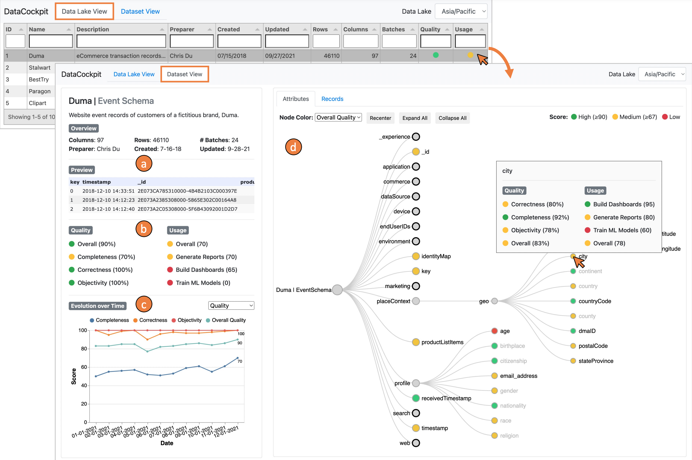

# Monitoring Tool

Using DataCockpit ([source](https://github.com/datacockpit-org/datacockpit)), we developed this visual monitoring tool to help users with navigation, discovery, and housekeeping tasks and also to act as a first line of defense during data ingestion, preventing "bad" data from entering the data lake altogether.

The **Data Lake View** lists all datasets in the data lake; the **Dataset View** provides additional information (e.g., a preview) about a specific dataset (a), corresponding quality and usage scores (b), temporal evolution of these scores (c), and an interactive visualization showing attribute and record-level quality and usage information (d).

  

## Setup and Run
- Start a simple webserver `python -m SimpleHTTPServer 8080` or `python3 -m http.server 8080`
- Open your favorite browser and point to `http://localhost:8080`
- Enjoy!!

 

## Develop
Integrate with DataCockpit ([source](https://github.com/datacockpit-org/datacockpit)) or manually update:
- `data/attribute_list.json` - to update list of attributes.
- `data/attribute_tree.json` - to update the tree representation of attributes as well as attribute-level efficacy (quality, usage, and business implication) insight values/scores.
- `data/dataset_insights.json` - to update the dataset-level efficacy (quality, usage, and business implication) insight values/scores as well as other dataset meta information.
- `dataEfficacyThresholds.js` - to tweak the efficacy insight thresholds that determine the red/yellow/green colors.

 

## Credits
DataCockpit was created by Arpit Narechania, Fan Du, Atanu R. Sinha, Ryan A. Rossi, Jane Hoffswell, Shunan Guo, Eunyee Koh, Surya Chakraborty, Shivam Agarwal, Shamkant B. Navathe, and Alex Endert.

 

## License
The software is available under the [MIT License](https://github.com/datacockpit-org/monitoring-tool/blob/master/LICENSE).

 

## Contact
If you have any questions, feel free to [open an issue](https://github.com/datacockpit-org/monitoring-tool/issues/new/choose) or contact [Arpit Narechania](http://narechania.com).